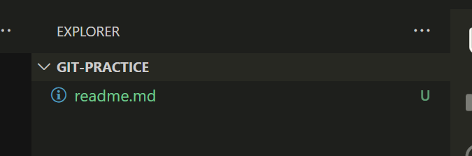
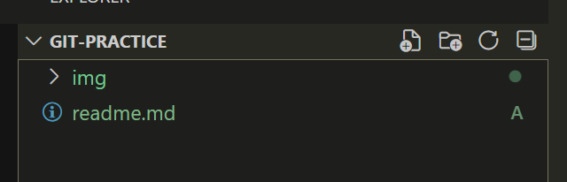

# Git

## Git là gì ?
- Git là một version control (hệ thống quản lý phiên bản source code)
- Git cung cấp hàng loạt các công cụ để:
    + Theo dõi lịch sử của source code
    + Blame người thực hiện thay đổi
    + Đồng bộ hoá, sao lưu giữa local, cloud repo.
    + Cho phép khôi phục code
    + Cho phép tạo ra nhiều workspace (branch), các workspace có thể tương tác với nhau

## Bắt đầu
> References: https://git-scm.com/docs/gittutorial
### Bước đầu tiên
- [Cài đặt Git](https://git-scm.com/downloads) vào máy tính đã :>
- Để kiểm tra cài đặt có thành công: 
```bash
git
```
### Chúng ta sẽ bắt đầu bằng cách tự giới thiệu bản thân:
```bash
$ git config --global user.name "Your Name Comes Here"          <== Điền tên
$ git config --global user.email you@yourdomain.example.com     <== Điền email
```
- Giới thiệu bản thân, là để Git sẽ theo dõi lại dòng code này là do ai viết ra (blame), ngoài ra khi commit code, người chịu trách nhiệm cho commit cũng sẽ sử dụng username và email trên
### Create/Import project
- Để bắt đầu với một project mới, hoặc một project trên local nhưng chưa sử dụng Git:
```bash
git init
```
- Một cách khác - import project có sẵn, nếu project được nén thì ngay khi mở ra Git sẽ tự động phát hiện
- Nếu cần import một project trên remote:
```bash
git clone "https://... .git"
```
- Clone một repo sẽ không yêu cầu phải đăng nhập định danh với dịch vụ đó, khi repo đó được public, Private thì phải đăng nhập

### Code time
- Chúng ta sẽ thêm một số thay đổi bên trong thư mục Git này
- Tạo một file readme.md
- Viết bừa một cái gì vào đó


- Khi này file readme.md đang ở trạng thái __*untracked*__, tức là Git không theo dõi lịch sử của file này
```bash
git add readme.md
```

- File chuyển sang trạng thái __*added*__, được Git theo dõi
- Ngoài ra còn một số trạng thái khác: Modified, Deleted
- Để thêm tất cả các file đã bị thay đổi trong quá trình làm việc:
```bash
git add .
```
hoặc nhiều file
```bash
git add file1 file2 file3
```
- Phân loại status của file theo 3 kiểu:
    + Thay đổi như thế nào:
        - unmodified, added, removed, modified
    + Có được git theo dõi không
        - not being tracked, tracked
    + Có mặt trong lần commit này không:
        - staged changes, non staged changes
- File Not being tracked: unmodified, non staged changes

### Người viết nên lịch sử
- Tạo ra một bản sao, snapshot cho project hiện tại
- Nó sẽ được lưu vào cây lịch sử của project, Git sẽ quản lý nó
```bash
git commit -m "Bạn đã thay đổi những gì ?"
```

### Kiểm tra tình trạng hiện tại của Project
1. Git status
+ Kiểm tra tình trạng thêm, xoá, sửa, chưa được theo dõi của các file trong project

+ Tương tự chúng ta có thể xem trên VCS của Vscode

_Các file .png nằm trong thư mục img_

2. Git log

- Toàn bộ các snapshot của project từ trước đến này, theo thứ tự gần đây nhất.
- Bao gồm: Author (cái mà chúng ta đã giới thiệu từ phần trước), Date: thời gian, và chú thích mà chúng ta đã ghi ở phần `-m "tin nhắn"`
- Ngoài ra ở đầu trên là một dãy loằng ngoằng, nó là id độc nhất vô nhị cho bản snapshot này, và một cái `HEAD -> master` sẽ được giải thích sau

### Câu lệnh hay dùng
#### Git remote:
- Repo là:
    + Giống hệt với một project thường, tuy nhiên có thêm một hidden folder `.git`, trong đó lưu tất cả các thứ thông tin liên quan đến Git: cây lịch sử, những thay đổi đã xảy ra hiện tại (chưa commit)
- Remote là:
    + Một repo trên cloud, hoặc ở bất cứ một máy chủ công ty hoặc tại nhà, miễn là nó không phải máy tính này
- Máy tính này là local
- Một remote có thể phân phối ra nhiều bản local (do remote là nơi lưu trữ chung)
- Ngược lại, một bản local có thể có nhiều remote (up lên nơi A, up lên nơi B)

- Thêm, đổi tên, xoá remote
- Khi clone thì git sẽ tạo ra 1 remote: 
name-value = 'remote'-'url clone'

#### Git push
- Up code từ local lên remote
```bash
# Lần đầu tiên up:
git push -u origin master
# Lần sau:
git push
```
trong đó 
-u: set mặc định branch sẽ nhận các cập nhật của branch này trong tương lai
origin: tên của remote
master: nhánh muốn up lên
- Ví dụ đang ở nhánh develop, up lên na/master sẽ là:
```bash
git push -u na master 
```

#### Git branch
- Branch là 1 nhánh, thông thường thì mỗi khi tạo ra một repo, sẽ có nhánh mặc định là `master` hoặc `main`. Từ một nhánh, chúng ta có thể tạo ra một nhánh mới là bản sao từ nó và làm việc độc lập, commit, push không gây bất cứ ảnh hưởng gì tới nhánh gốc.


#### Git fetch
- Tải xuống toàn bộ các cập nhật ở trên các remote mà máy mình bị outdated, tuy nhiên chỉ để đệm đó chứ chưa apply vào các branch local

#### Git merge
- Sát nhập branch __target__ vào branch __destination__
- Nếu dòng thứ i của branch __destination__ giống với của dòng i của __target__ thì không sao
- Nhưng nếu nó khác -> Merge conflict
- Phải giải quyết: chọn một trong 2 phiên bản dòng thứ i của 2 branch, hoặc giữ cả 2
- Toàn bộ commit của branch target sẽ được hợp làm với branch destination, và được sắp xếp lại theo dòng thời gian cây lịch sử

#### Git pull
- là git fetch sau đó git merge vào current branch
- Trong khi git fetch không ảnh hưởng tới pwd, thì git fetch có cái merge kia có khả năng sẽ gây ra merge conflict

#### 